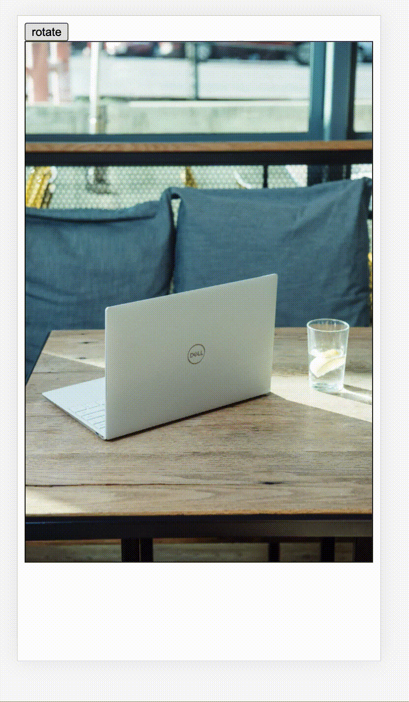

# image-orientational

> rotate img element



## Usage

cdn
```html
<button id="btn">rotate</button>
    <div id="container" style="border: 1px solid">
      <div id="wrapper">
        
      </div>
    </div>
```
```javascript
imageOrientational
    .createImageOrientation({
        container,
        wrapper,
        image,
    })
    .then((instance) => {
        var angle = 0;
        btn.onclick = () => {
            instance.rotate((angle += 90));
        };
    });
```

or use npm package

```javascript
import { createImageOrientation } from 'image-orientational';
createImageOrientation({
    container,
    wrapper,
    image,
});
```

## Thanks

- [modernjs](https://github.com/modern-js-dev/modern.js)
- [rollup](https://github.com/rollup/rollup)
